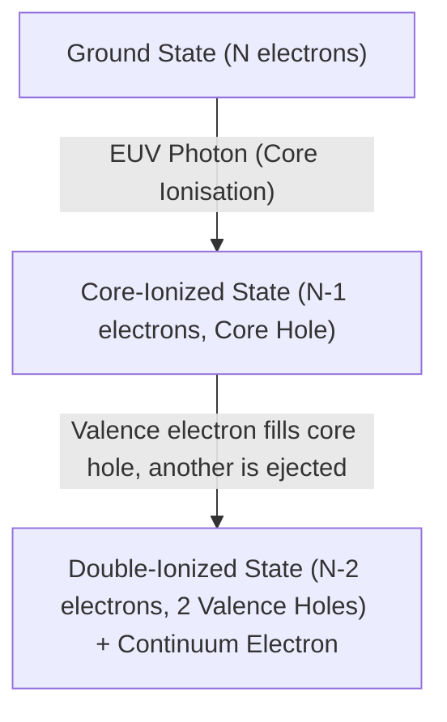

# Theoretical and Implementation Guide: Auger and Absorption Spectroscopy via GQE and q-sc-EOM

This document provides a comprehensive, first-principles guide to the quantum chemistry and quantum computing methods implemented in this repository for simulating the Auger electron spectrum and absorption spectrum of molecules. It is tailored for researchers with a background in quantum mechanics and mathematics who want a pedagogical refresher and a deep dive into the code.

---

## 1. Introduction: Auger Electron Spectroscopy & EUV Lithography

**Auger Electron Spectroscopy (AES)** is a key analytical tool for characterising the electronic structure of molecules and materials. In the context of **Extreme Ultraviolet (EUV) Lithography**, understanding the Auger decay processes of molecules under EUV radiation is critical for predicting radiation chemistry and designing next-generation photoresists.

### The Physics of Auger Decay
Auger decay is a two-step radiationless process:
1. **Core Ionisation:** An incoming EUV photon ejects a core-shell electron (e.g., from the Oxygen 1s orbital of water), leaving the molecule in a highly unstable core-ionized state $|\Phi_{\text{IP}}\rangle$.
2. **Valence Relaxation & Emission:** A valence electron falls into the core hole to fill it. The energy released by this transition is transferred to a second valence electron, which is ejected into the continuum as an Auger electron with kinetic energy $E_{\text{kin}}$. The final state of the molecule is a double-ionized state $|\Phi_{\text{DIP}}\rangle$.

The kinetic energy of the ejected Auger electron is given by energy conservation:
$$E_{\text{kin}} = E_{\text{IP}} - E_{\text{DIP}}$$
where $E_{\text{IP}}$ is the energy of the core-ionized state, and $E_{\text{DIP}}$ is the energy of the double-ionized state. The probability (intensity) of the transition is governed by Fermi's Golden Rule.

---

## 2. Pedagogical Refresher: Spin Multiplicity & Symmetry Sectors

### Single-Electron Spin
An electron has spin $s = \frac{1}{2}$. The spin state vector lives in a 2D Hilbert space spanned by the eigenstates of the spin operator $s_z$:
- Spin-up: $|\uparrow\rangle$ with eigenvalue $m_s = +\frac{1}{2}$
- Spin-down: $|\downarrow\rangle$ with eigenvalue $m_s = -\frac{1}{2}$

### Two-Electron Spin Coupling
For two electrons (or two valence holes), the total spin operator is $\mathbf{S} = \mathbf{s}_1 + \mathbf{s}_2$. The total spin quantum number $S$ can be $0$ or $1$. The projection along the z-axis is $M_S = m_{s,1} + m_{s,2}$.

Using Clebsch-Gordan coefficients, we couple the two spin-$\frac{1}{2}$ states:
1. **Singlet State ($S = 0$):**
   There is only one projection ($M_S = 0$). The spin wavefunction is antisymmetric under particle exchange:
   $$\chi_{\text{singlet}} = \frac{1}{\sqrt{2}} \left( |\uparrow\downarrow\rangle - |\downarrow\uparrow\rangle \right)$$
   The multiplicity is $2S + 1 = 1$.

2. **Triplet States ($S = 1$):**
   There are three projections ($M_S = 1, 0, -1$). The spin wavefunctions are symmetric under exchange:
   $$\chi_{\text{triplet}, M_S=1} = |\uparrow\uparrow\rangle$$
   $$\chi_{\text{triplet}, M_S=0} = \frac{1}{\sqrt{2}} \left( |\uparrow\downarrow\rangle + |\downarrow\uparrow\rangle \right)$$
   $$\chi_{\text{triplet}, M_S=-1} = |\downarrow\downarrow\rangle$$
   The multiplicity is $2S + 1 = 3$.

### Spin Multiplicity in Auger Final States
In the final state of normal Auger decay, the molecule has two holes in the active space. Because the spatial wavefunction and spin wavefunction must multiply to form a totally antisymmetric state (Pauli Exclusion Principle), the spatial symmetry of the final state determines the allowed spin state:
- If the two holes are in the same spatial orbital, they must have opposite spins, forming a **singlet** state ($^1\Sigma$ or similar).
- If the two holes are in different spatial orbitals, they can couple to form either a **singlet** or a **triplet** state ($^3\Sigma$, $^1\Delta$, etc.).
To model the complete Auger spectrum, we must capture both singlet and triplet double-ionized states.

---

## 3. Active Space Reduction & Pseudopotentials (ECP & AVAS)

Simulating large molecules like 4-iodo-2-methylphenol (IMePh) on quantum computers requires limiting the qubit count. We achieve this through two main techniques: Effective Core Potentials (ECPs) and Atomic Valence Active Space (AVAS).

### Effective Core Potentials (ECPs)
For heavy atoms (e.g., Iodine, $Z=53$), the inner core electrons are chemically inert but add massive overhead to the qubit count (requiring a large number of orbitals and electrons) and are highly relativistic. **Effective Core Potentials (ECPs)**, also known as pseudopotentials, replace these core electrons with an effective potential, freezing them.

#### How the LANL2DZ ECP Works:
- **Core Replacement:** For Iodine ($Z=53$), the Los Alamos National Laboratory 2-double-zeta (LANL2DZ) ECP replaces the innermost 46 core electrons ($1s^2 2s^2 2p^6 3s^2 3p^6 3d^{10} 4s^2 4p^6 4d^{10}$) with an analytical local and non-local potential acting on the valence electrons.
- **Valence Space:** This leaves only the 7 valence electrons ($5s^2 5p^5$) in the valence space.
- **IMePh Valence Electron Count:** For IMePh ($C_7H_7IO$), the total number of valence electrons becomes:
  $$\text{Electrons} = (7 \times 6)_{\text{C}} + (7 \times 1)_{\text{H}} + 8_{\text{O}} + 7_{\text{I, valence}} = 64 \text{ electrons}$$
  This is a significant reduction from the 110 all-electron representation.
- **Implementation:** Implemented in [euv_spectra.py:L1836-1852](file:///Users/nvenkat/Desktop/Repos/gic_2026/mitsubishi/phase_3/code/euv_spectra.py#L1836-L1852) where we map the `lanl2dz` ECP to Iodine and `sto-3g` to other atoms.

### Active Space Selection Constraints
The active space parameters (`active_electrons` and `active_orbitals`) cannot be set arbitrarily. They are bound by mathematical and physical constraints:

1. **Mathematical Consistency:**
   - **Electron Conservation:** The number of active electrons ($N_e$) must be an even integer (for singlet ground-state calculations) and cannot exceed the total number of valence electrons ($64$).
   - **Qubit/Orbital Bound:** The active electrons must fit within the spatial orbitals: $N_e \le 2 N_{\text{orb}}$.
   - **Orbital Limit:** The number of active spatial orbitals ($N_{\text{orb}}$) cannot exceed the total number of molecular orbitals in the basis set.

2. **Physical Constraints & Accuracy:**
   - **Targeting Transition Pathways:** The active space must contain the key orbitals that participate in the physical processes we are simulating. For EUV absorption and subsequent Auger decay:
     - The inner shell Iodine 4d/5p and core Oxygen 1s orbitals (which participate in the core excitation and relaxation) must be included.
     - The target valence molecular orbitals must be included to accurately capture double-ionization final states.
     - Excluding these critical orbitals will result in unphysical transition dipole moments and zero Auger decay intensities.
   - **Hardware/VRAM Constraints:** The number of spatial orbitals $N_{\text{orb}}$ determines the number of qubits ($2 N_{\text{orb}}$). 
     - **36 Qubits (18 active orbitals)**: The state-vector memory requirement is $\sim 1,099.5 \text{ GB}$ (fitting on an 8x B200 SXM6 cluster with 1,440 GB VRAM).
     - **32 Qubits (16 active orbitals)**: The state-vector memory requirement is $\sim 68.7 \text{ GB}$ (fitting on an 8x H100 SXM5 cluster with 640 GB VRAM).
     - Because of these limits, the active space is tailored as **CAS(24e, 18o)** for the B200 target, and scaled down to **CAS(16e, 16o)** for the H100 target to avoid Out Of Memory (OOM) errors.

### Atomic Valence Active Space (AVAS)
**AVAS** selects a chemically active subset of molecular orbitals (MOs) by projecting the full molecular orbital space onto a target set of atomic valence orbitals (e.g., Oxygen 2s and 2p).
Let $C$ be the MO coefficient matrix and $P_v = |v\rangle\langle v|$ be the projector onto the target valence orbitals. We define the overlap/projection matrix:
$$D = T^{-1} U C$$
where $T$ is the Minimal Basis Set (MBS) overlap matrix and $U$ is the MBS-to-full-basis overlap matrix.
- Implemented in [_build_pyscf_molecular_integrals](file:///Users/nvenkat/Desktop/Repos/gic_2026/mitsubishi/phase_3/code/qsceom.py#L89-L162).

---

## 4. Compressed Double Factorization (CDF)

The electronic Hamiltonian contains $O(N^4)$ two-body Coulomb integrals $V_{pqrs}$. Double Factorization reduces this complexity.

### Double Factorization (DF)
We write the two-body integral tensor in chemist notation $V_{pqrs} = (pq|rs)$ as a sum of Cholesky vectors, and diagonalise each factor:
$$V_{pqrs} = \sum_{t=1}^{N_c} g^{(t)}_{pq} g^{(t)}_{rs} = \sum_{t=1}^{N_c} U^{(t)} \Lambda^{(t)} (U^{(t)})^\dagger$$
where $U^{(t)}$ is a unitary matrix representing orbital rotations, and $\Lambda^{(t)}$ is a diagonal core tensor.

### Block-Invariant Symmetry Shift (BLISS)
We shift the Hamiltonian by adding terms proportional to the number operator $\hat{N}$ that commute with the Hamiltonian:
$$\hat{H} \to \hat{H} - \lambda \hat{N}$$
This reduces the one-norm of the Hamiltonian, lowering the measurement variance (shot noise) on quantum hardware.

### Compressed Double Factorization (CDF)
**CDF** uses non-linear optimization with L2 regularization to fit the rotations $U^{(t)}$ and diagonal values $\Lambda^{(t)}$ using a small rank $N_c$, minimizing the reconstruction error:
$$\mathcal{L} = ||V_{\text{shift}} - V'_{\text{shift}}||_F^2 + \alpha \sum_t ||\Lambda^{(t)}||_2^2$$
- Implemented in [compute_cdf_hamiltonian](file:///Users/nvenkat/Desktop/Repos/gic_2026/mitsubishi/phase_3/code/euv_spectra.py#L126-L198) using JAX and Optax.

---

## 5. Absorption Spectroscopy: Time-Domain Green's Functions

### Dipole Strength Function
The molecular absorption spectrum is proportional to the dipole strength function $S(\omega)$, which measures the transition probability from the ground state $|\Phi_0\rangle$ to all dipole-allowed excited states $|\Phi_n\rangle$:
$$S(\omega) = \sum_n |\langle \Phi_n | \hat{\mu} | \Phi_0 \rangle|^2 \delta(\omega - (E_n - E_0))$$
where $\hat{\mu} = \sum_\rho \hat{m}_\rho$ is the dipole operator along the Cartesian coordinates.

### Time-Domain Simulation & Hadamard Test
Rather than diagonalizing the Hamiltonian for hundreds of excited states (which scales exponentially), we simulate the absorption process in the time domain. We define the time-dependent Green's function (autocorrelation function):
$$G(t) = \langle \Phi_0 | \hat{\mu}^\dagger e^{-i \hat{H} t} \hat{\mu} | \Phi_0 \rangle = \sum_n |\langle \Phi_n | \hat{\mu} | \Phi_0 \rangle|^2 e^{-i E_n t}$$
We prepare the normalized initial state $|\phi\rangle = \hat{\mu} | \Phi_0 \rangle / \|\hat{\mu} | \Phi_0 \rangle\|$ on the quantum register. We then use the **Hadamard Test** (using an auxiliary control qubit on wire 0) to measure the real and imaginary parts of the propagator:
$$\langle X_0(t) \rangle = \text{Re} \langle \phi | e^{-i \hat{H} t} | \phi \rangle$$
$$\langle Y_0(t) \rangle = -\text{Im} \langle \phi | e^{-i \hat{H} t} | \phi \rangle$$
- Evaluated iteratively via `trotter_step_circuit` and `measurement_circuit` in [euv_spectra.py:L833-850](file:///Users/nvenkat/Desktop/Repos/gic_2026/mitsubishi/phase_3/code/euv_spectra.py#L833-850).

### Defining the Plot Legends:
- **"Quantum (FT)"**: The absorption spectrum obtained by Fourier transforming the simulated quantum time-domain signal $G(t)$ with a Lorentzian lifetime damping envelope $e^{-\eta t}$:
  $$S_{\text{quantum}}(\omega) = \frac{1}{\pi} \text{Re} \int_0^\infty e^{-\eta t} G(t) e^{i \omega t} dt$$
- **"Classical (Exact)"**: The exact reference spectrum obtained by full diagonalization (CASCI/FCI) of the active space Hamiltonian to find the exact excited state energies $E_n$ and transition dipole moments $\langle \Phi_n | \hat{\mu} | \Phi_0 \rangle$, then plotting their sum as a series of Lorentzians with half-width $\eta = 0.05\text{ Hartree}$.

### The Aliasing Problem & Rotating Frame Fix
1. **The Problem:** The molecular Hamiltonian $\hat{H}$ has a ground state energy of $E_0 \approx -76\text{ Hartree}$. Evolving with the unshifted Hamiltonian causes the statevector to oscillate at a massive frequency of $\sim 76\text{ Hartree}$ (period $T \approx 0.08\text{ a.u.}$). A time step of $\tau = 0.5\text{ a.u.}$ severely undersamples this oscillation, violating the Nyquist-Shannon limit ($\Delta t < 0.04\text{ a.u.}$) and washing out the Fourier transform into a flat line at 0.
2. **The Fix:** We shift the simulation to the rotating frame of the ground state energy $E_i$. We add a controlled phase shift `qml.PhaseShift(E_i * tau, wires=0)` at each Trotter step, shifting the eigenvalues to $E_n - E_i$ (the excitation energies, which range from $0$ to $1.5\text{ Hartree}$). The oscillation period increases to $\approx 4.2\text{ a.u.}$, allowing $\tau = 0.5\text{ a.u.}$ to resolve the peaks perfectly without aliasing.

---

## 6. Quantum Self-Consistent Equation-of-Motion (q-sc-EOM)

The **q-sc-EOM** method diagonalises the Hamiltonian in a subspace of excited states.

### Subspace Diagonalisation
The subspace is generated by applying single and double excitations to the ground state $|\Psi_0\rangle = U(\theta)|\Phi_{\text{HF}}\rangle$:
$$|\Psi_i\rangle = U(\theta) | \Phi_i \rangle$$
where $| \Phi_i \rangle$ is a computational basis configuration (an excitation configuration of the HF state). The matrix elements of the subspace Hamiltonian are:
$$M_{ij} = \langle \Phi_i | U^\dagger(\theta) \hat{H} U(\theta) | \Phi_j \rangle$$
We solve the generalised eigenvalue problem $M C = E S C$ to find the excited state energies and eigenvectors.

### $Z_2$ Symmetry Tapering
To reduce the qubit requirements of quantum chemistry simulations, we exploit the discrete symmetries of the molecular Hamiltonian. Under the Jordan-Wigner transformation, a system of $N$ spatial orbitals maps to $2N$ spin-orbitals (and thus $2N$ qubits). Symmetries in the physical system allow us to taper off (eliminate) qubits that are classically determined.

#### Mathematical Foundation
In any molecular Hamiltonian, there are physical symmetries that commute with the Hamiltonian:
1. **Particle Number Conservation:** The number of spin-up ($\alpha$) and spin-down ($\beta$) electrons are conserved individually.
2. **Point Group Symmetries:** Spatial symmetries of the molecular geometry (e.g., $C_{2v}$ symmetry in water) commute with the electronic Hamiltonian.

When mapped to the qubit space, these symmetries correspond to a set of $L$ independent, mutually commuting Pauli operators $\{ \tau_1, \tau_2, \dots, \tau_L \}$ (generators of a $\mathbb{Z}_2^L$ symmetry group) that satisfy:
* $[\tau_j, H] = 0$ for all $j=1, \dots, L$
* $[\tau_j, \tau_m] = 0$ for all $j, m$
* $\tau_j^2 = I$ for all $j$

Because these operators are mutually commuting and square to Identity, they can be simultaneously diagonalized, partition the Hilbert space into distinct symmetry sectors. Each sector is characterized by a tuple of eigenvalues $(s_1, s_2, \dots, s_L)$, where $s_j \in \{+1, -1\}$.

#### The Clifford Transformation
We construct a Clifford unitary transformation $U$ that maps these generators onto single-qubit Pauli $Z$ operators on specific target qubits $\{ q_1, q_2, \dots, q_L \}$:
$$U \tau_j U^\dagger = Z_{q_j}$$

Applying this transformation to the Hamiltonian yields a transformed representation:
$$H' = U H U^\dagger$$

Because the transformed Hamiltonian must commute with the transformed generators ($[H', Z_{q_j}] = 0$), $H'$ **cannot contain any Pauli $X$ or $Y$ operators** on qubits $q_1, \dots, q_L$. It can only contain $I$ or $Z$ on those qubits.

Since we restrict the simulation to a target symmetry sector (typically the singlet ground-state sector), the expectation values of these qubits are fixed constants:
$$\langle Z_{q_j} \rangle = s_j \in \{+1, -1\}$$

Therefore, we can replace all occurrences of $Z_{q_j}$ in $H'$ with their eigenvalues $s_j$ and completely drop the qubits $\{ q_1, \dots, q_L \}$ from our active register. This reduces the total qubit requirement from $2N$ to $2N - L$.

#### Why Water ($\text{H}_2\text{O}$) Reduces to 11 Qubits
In the minimal `sto-3g` basis set:
* **Initial Representation:** Water has 7 spatial orbitals $\implies$ 14 spin-orbitals $\implies$ **14 qubits**.
* **Symmetries Found ($L$):** The tapering algorithm identifies **$L=3$ independent $\mathbb{Z}_2$ symmetries** in the water Hamiltonian:
  1. Spin-up ($\alpha$) electron parity conservation.
  2. Spin-down ($\beta$) electron parity conservation.
  3. A spatial reflection symmetry associated with the $C_{2v}$ point group.
* **Qubit Reduction:** We taper off exactly $L=3$ qubits.
* **Final Qubit Count:**
  $$14 - 3 = 11 \text{ qubits}$$

Because the number of independent symmetries $L$ is odd, we subtract an odd number from an even number ($14$), resulting in an odd number of active simulation qubits ($11$). Symmetries are preserved classically, allowing us to reconstruct the full state vector.
- Implemented in [qsceom.py:L988-1017](file:///Users/nvenkat/Desktop/Repos/gic_2026/mitsubishi/phase_3/code/qsceom.py#L988-L1017).

### The Multi-Sector Tapering Fix
When $Z_2$ tapering is enabled, the Hamiltonian is projected into a single optimal sector of the $Z_2$ symmetry (typically the singlet ground-state sector).
- **The Bug:** Restricting the DIP run to a single optimal sector projects out all triplet double-ionized states (which lie in a different spin parity sector).
- **The Solution:**
  1. Modify [inite](file:///Users/nvenkat/Desktop/Repos/gic_2026/mitsubishi/phase_3/code/excitations.py) to generate excitations relative to the tapered HF reference (`ref_occ`).
  2. Implement [reconstruct_untapered_basis](file:///Users/nvenkat/Desktop/Repos/gic_2026/mitsubishi/phase_3/code/qsceom.py#L465-L515) to reconstruct the untapered configurations from the tapered ones by solving:
     $$\sum_{i \in \text{support}(G_k)} x_i \pmod 2 = \frac{1 - \sigma_k}{2}$$
  3. Run `qscEOM` for both the singlet optimal sector (`mult=1`) and triplet optimal sector (`mult=3`), block-diagonalizing and combining the resulting states to capture the full spectrum.

### Koopmans' Theorem, Core Orbital Relaxation, and Energy Shift
**Koopmans' theorem** states that the first ionization energy of a closed-shell molecule is approximately equal to the negative of the Hartree-Fock orbital energy of the occupied molecular orbital from which the electron is removed:
$$IP \approx -\epsilon_i$$
However, this theorem makes two major approximations:
1. **Neglect of Orbital Relaxation:** It assumes the molecular orbitals of the ionized state ($N-1$ electrons) are identical to the neutral ground state ($N$ electrons). In reality, when an electron is removed, the remaining electrons contract towards the nucleus due to decreased screening. This orbital relaxation lowers the energy of the ionized state.
2. **Neglect of Electron Correlation:** It neglects changes in the electron correlation energy upon ionization.

For core-shell electrons (such as the Oxygen 1s of water), the orbital relaxation effect is massive ($\sim 10\text{ to }20\text{ eV}$). 

In our quantum q-sc-EOM calculations, we use a frozen-orbital configuration space. Because the orbitals do not relax in response to the core hole, the calculated core-ionization potential $E_{\text{IP}}$ is systematically overestimated by the core-orbital relaxation energy ($\sim 10.3\text{ eV}$). In contrast, the double-ionization states ($E_{\text{DIP}}$) have a fully occupied core shell, so they do not experience this core-hole relaxation error.

Consequently, the calculated Auger kinetic energies $E_{\text{kin}} = E_{\text{IP}} - E_{\text{DIP}}$ are systematically shifted to higher energies. We compute this core-relaxation shift from first principles (reference-free and fully scalable) using a **$\Delta$SCF (Delta Self-Consistent Field)** approach in PySCF:
$$E_{\text{kin}}^{\text{corrected}} = (E_{\text{IP}} - E_{\text{DIP}}) - \Delta E_{\text{relax}}^{\text{net}}$$
where the net relaxation shift $\Delta E_{\text{relax}}^{\text{net}}$ is the difference between core-hole and valence-hole relaxation energies:
$$\Delta E_{\text{relax}}^{\text{net}} = (IP_{\text{core, Koopmans}} - IP_{\text{core, }\Delta\text{SCF}}) - (IP_{\text{valence, Koopmans}} - IP_{\text{valence, }\Delta\text{SCF}})$$
To prevent variational collapse to a valence-ionized state during the excited-state core-hole SCF iterations, we employ the **Maximum Overlap Method (MOM)** via `pyscf.scf.addons.mom_occ`.
- Implemented in [euv_spectra.py:L2558-L2628](file:///Users/nvenkat/Desktop/Repos/gic_2026/mitsubishi/phase_3/code/euv_spectra.py#L2558-L2628).

---

## 7. One-Center Approximation (OCA) & Auger Intensities

### The One-Center Approximation
The Auger transition matrix element involves a two-electron Coulomb integral:
$$T_{K \leftarrow I} = \langle \Phi_K | \hat{H}_{\text{Auger}} | \Phi_I \rangle$$
Because the core orbital $\phi_c$ (e.g. Oxygen 1s) is extremely localized on the emitter atom, we approximate all transition integrals by restricting them to the center of the emitter atom:
$$\langle \phi_c \phi_e | r_{12}^{-1} | \phi_p \phi_q \rangle \approx \sum_{\mu, \nu \in \text{MBS}} C_{\mu p} C_{\nu q} \langle \chi_c \chi_e | r_{12}^{-1} | \chi_\mu \chi_\nu \rangle$$
where $\chi$ are minimal basis set (MBS) atomic orbitals centered exclusively on the emitter atom.

### Transition Reduced Density Matrix (RDM)
The Transition RDM elements between the core-ionized state $|\Phi_I\rangle$ and double-ionized states $|\Phi_K\rangle$ are defined as:
$$\gamma_{pq, K, I} = \langle \Phi_K | a^\dagger_c a_q a_p | \Phi_I \rangle$$
- Computed in [compute_gamma_pq](file:///Users/nvenkat/Desktop/Repos/gic_2026/mitsubishi/phase_3/code/euv_spectra.py#L2040-L2090).

### Spin-Orbital Expansion & Fermi's Golden Rule
The Auger intensity (Gamma) of the transition to double-ionized state $K$ is:
$$\Gamma_K = 2\pi \sum_{e} |A_{K \leftarrow I, e}|^2$$
The transition amplitude $A$ is computed by contracting the Transition RDM with the projected integrals:
$$A_{K \leftarrow I, e} = \sum_{pq} \gamma_{pq, K, I} \left[ \langle c e | p q \rangle - \langle c e | q p \rangle \right]$$
- **Direct Term:** $\langle c e | p q \rangle$, where spin of $p$ matches continuum spin ($s_e$) and spin of $q$ matches core spin ($s_c$).
- **Exchange Term:** $\langle c e | q p \rangle$, where spin of $q$ matches continuum spin ($s_e$) and spin of $p$ matches core spin ($s_c$).
- Contraction implemented in [euv_spectra.py:L2160-2195](file:///Users/nvenkat/Desktop/Repos/gic_2026/mitsubishi/phase_3/code/euv_spectra.py#L2160-L2195).

---

## 8. Summary of Active Space and Hamiltonian Reduction Techniques

To perform simulations of core-excited and valence states under hardware VRAM constraints (e.g. B200, H100, Mac environments), this codebase leverages three key dimensionality and term reduction techniques:

| Technique | Reduces Qubits? | Reduces Hamiltonian Terms? | Reduces Gate Count / Circuit Depth? | Key Mechanism |
| :--- | :---: | :---: | :---: | :--- |
| **ECP & AVAS** | **Yes** | **Yes** | **Yes** | Replaces core electrons with Effective Core Potentials and projects full basis molecular orbitals onto target atomic valence orbitals. |
| **$Z_2$ Tapering** | **Yes** | **Yes** | **Yes** | Explores physical conservation laws (spin, point group symmetries) to taper off ($q_j \to \pm 1$) exactly $L$ qubits. |
| **BLISS/CDF** | **No** | **Yes** | **Yes** | Performs Compressed Double Factorization on the two-body Coulomb tensor to compress $O(N^4)$ terms to $O(L \cdot N^2)$ low-rank operators, optimizing Trotter steps. |

